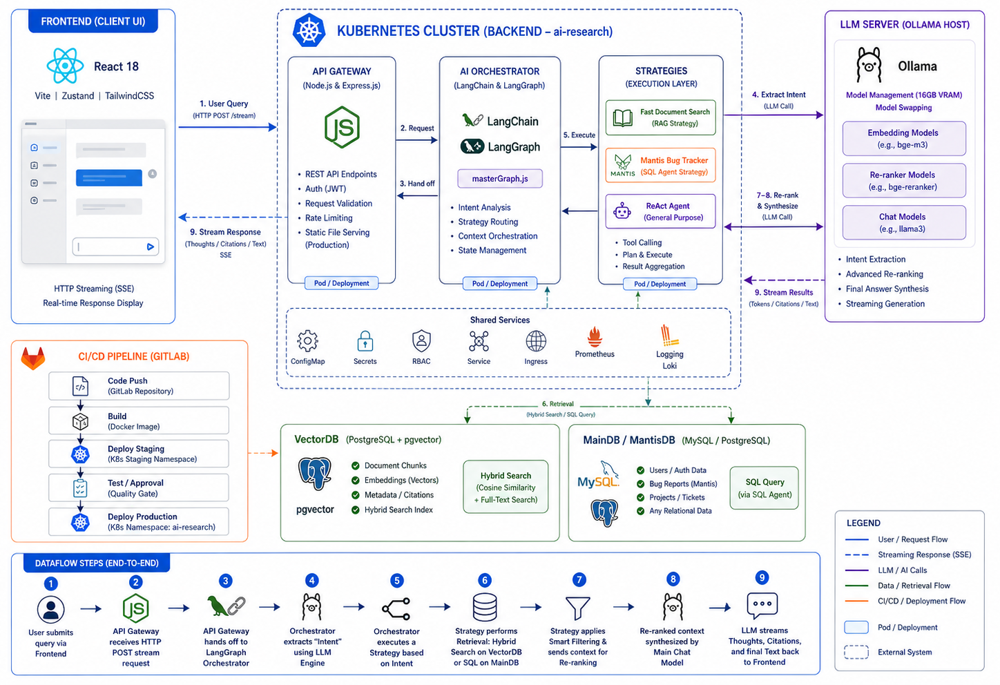
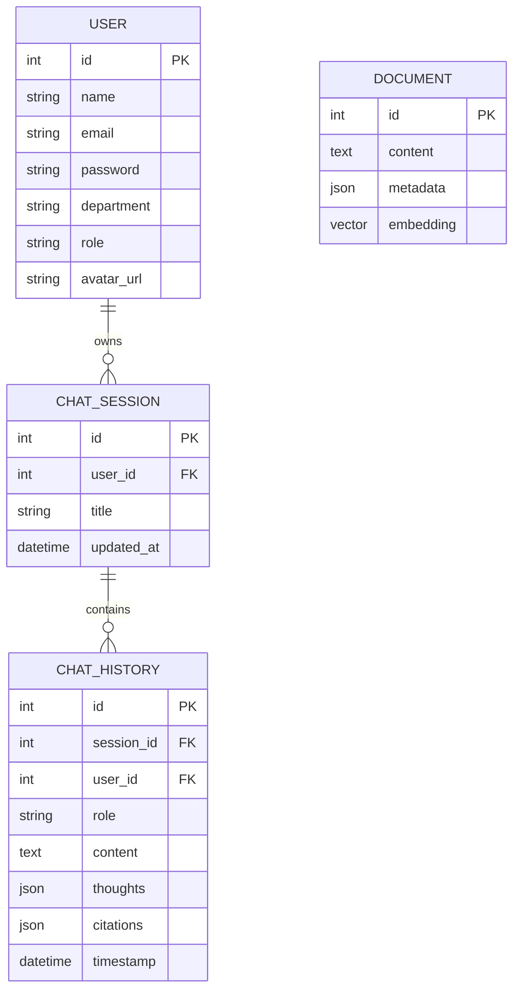

# WebClient AI Workspace - Advanced Agentic RAG System

WebClient AI Workspace is a sophisticated AI-driven chat platform designed for enterprise-level data analysis, bug tracking (Mantis DB integration), and intelligent knowledge retrieval (Document RAG). The system leverages Agentic RAG, Ollama, LangChain, and LangGraph to deliver high-precision, context-aware responses.

---

## System Architecture

The system is built on a modular architecture that separates the frontend interface from the complex AI orchestration logic, ensuring scalability and robust performance.

### 1. Technology Stack
*   **Frontend:** React 18, Vite, TailwindCSS, and Zustand for state management.
*   **Backend / API Gateway:** Node.js with Express.js, providing a high-performance bridge between the client and AI services.
*   **AI Orchestration:** 
    *   **LangChain:** Manages prompts, LLM abstractions, and chat history.
    *   **LangGraph:** Orchestrates complex workflows through state machines, managing the "Thought Process" and agent behavior.
    *   **LlamaIndex:** Utilized for advanced document indexing and re-ranking.
*   **Data Persistence:**
    *   **PostgreSQL (with pgvector):** Handles semantic vector search and hybrid retrieval.
    *   **MySQL:** Directly interfaces with the Mantis Bug Tracker system for real-time issue analysis.

---

## Database Schema (Entity-Relationship)

---

## Advanced Retrieval-Augmented Generation (RAG)

The platform employs a multi-stage Agentic RAG pipeline to ensure data accuracy and relevance:

### Stage 1: Pre-Retrieval Optimization
*   **Intent Analysis:** The system analyzes user queries to determine the optimal strategy (e.g., General Search, Image Retrieval, or Database Querying).
*   **Query Expansion:** Uses HyDE (Hypothetical Document Embeddings) and multi-query rewriting to improve search coverage.

### Stage 2: Hybrid Retrieval
*   **Vector Search:** Performs mathematical similarity searches using pgvector (Cosine Similarity).
*   **Full-Text Search (FTS):** Complements vector search by matching specific keywords using PostgreSQL's lexical search capabilities.
*   **Dynamic SQL Generation:** For bug tracking requests, the AI generates and executes optimized SQL queries against the Mantis database.

### Stage 3: Post-Retrieval Processing
*   **Semantic Re-ranking:** Re-evaluates top-k results using a cross-encoder model to surface the most relevant information.
*   **Contextual Synthesis:** Aggregates retrieved documents into a structured context for final answer generation, ensuring responses are grounded in verified data.

---

## Performance and Resource Management

Designed to operate within constrained hardware environments (e.g., 16GB VRAM), the system implements several optimization techniques:

*   **Dynamic Model Swapping:** Efficiently loads and unloads models (Embeddings, Re-rankers, and LLMs) from GPU memory to prevent Out-of-Memory (OOM) errors.
*   **Response Streaming:** Utilizing Server-Sent Events (SSE), the system streams tokens and internal "Thought" steps to the user in real-time, reducing perceived latency.
*   **Intelligent Caching:** Implements caching layers for embeddings and common queries to minimize redundant AI processing.

---

## Infrastructure and Deployment

The project is fully containerized and ready for enterprise deployment:

*   **Containerization:** Optimized Multi-stage Docker builds for minimal image size.
*   **Orchestration:** Deployment-ready configurations for Kubernetes (K8s).
*   **CI/CD Pipeline:** Fully automated GitLab CI/CD pipelines for building, testing, and deploying to staging and production environments.

---

## Diagram Generation

To regenerate the architecture diagram, you can use the following prompt with Mermaid.js or AI-based diagramming tools:

> Please generate an Architecture and Dataflow Diagram for "WebClient AI Workspace". Include:
> 1. Frontend: React/Vite/Zustand.
> 2. Backend Gateway: Node.js/Express.
> 3. Orchestrator: LangGraph/LangChain State Machine.
> 4. AI Engine: Ollama (with Model Swapping logic).
> 5. Databases: PostgreSQL (Vector) and MySQL (Relational).
> 6. CI/CD: GitLab/Kubernetes.
