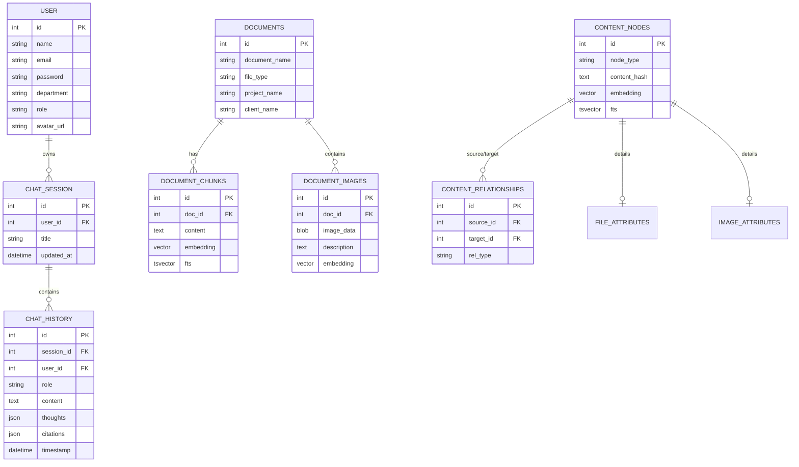

# WebClient AI Workspace — Advanced Agentic RAG System

An enterprise-grade AI chat platform for intelligent document retrieval, bug tracking analysis, and context-aware knowledge synthesis. Built on a fully local, privacy-first stack with no external AI API dependencies.

---

## Key Features

- **Agentic RAG Pipeline** — multi-stage retrieval with intent analysis, query expansion (HyDE), hybrid search, and semantic re-ranking
- **Document Intelligence** — query PDFs and internal documents with source citations and image-aware retrieval
- **Bug Tracker Integration** — natural language interface over Mantis DB; AI generates and executes SQL in real-time
- **Local LLM via Ollama** — runs entirely on-premises, keeping all data within your infrastructure
- **Thought Process Transparency** — real-time streaming of reasoning steps alongside answers via SSE
- **Multi-user Sessions** — per-user chat history with session management and role-based access
- **Resource-Aware Execution** — dynamic model swapping to run within 16 GB VRAM without OOM errors
- **Production-Ready** — containerized with Docker, orchestrated via Kubernetes, automated via GitLab CI/CD

---

## Use Cases

| Scenario | How the system helps |
|---|---|
| Internal document Q&A | Employees query project specs, manuals, or reports in natural language |
| Bug tracker analysis | Ask "What are the top open critical bugs in Project X?" — AI queries Mantis DB directly |
| Cross-project knowledge | Retrieve related content across documents and sessions via graph-based relationships |
| Constrained hardware | Run a full RAG stack on a single workstation GPU without cloud dependencies |

---

## System Architecture

The system is built on a modular architecture that separates the frontend interface from the AI orchestration logic, ensuring scalability and robust performance.

### Technology Stack

| Layer | Technologies |
|---|---|
| **Frontend** | React 18, Vite, TailwindCSS, Zustand |
| **Backend / API Gateway** | Node.js, Express.js |
| **AI Orchestration** | LangChain, LangGraph, LlamaIndex |
| **AI Runtime** | Ollama (local LLM serving) |
| **Vector & Relational DB** | PostgreSQL + pgvector |
| **Bug Tracker DB** | MySQL (Mantis Bug Tracker) |

---

## Database Schema (Entity-Relationship)

The system uses a dual-layer database approach: a **Relational/Vector Layer** for chat and document management, and a **Unified Content Layer** for advanced RAG graph relationships.

---

## Advanced Retrieval-Augmented Generation (RAG)

The platform employs a multi-stage Agentic RAG pipeline to ensure data accuracy and relevance:

### Stage 1: Pre-Retrieval Optimization
- **Intent Analysis** — determines optimal retrieval strategy (General Search, Image Retrieval, or Database Querying)
- **Query Expansion** — uses HyDE (Hypothetical Document Embeddings) and multi-query rewriting to improve search coverage

### Stage 2: Hybrid Retrieval
- **Vector Search** — mathematical similarity search using pgvector (Cosine Similarity)
- **Full-Text Search (FTS)** — complements vector search with PostgreSQL lexical keyword matching
- **Dynamic SQL Generation** — for bug tracking requests, AI generates and executes optimized SQL against Mantis DB

### Stage 3: Post-Retrieval Processing
- **Semantic Re-ranking** — re-evaluates top-k results using a cross-encoder model to surface the most relevant information
- **Contextual Synthesis** — aggregates retrieved documents into a structured context for final answer generation, grounded in verified data

---

## Performance and Resource Management

Designed to operate within constrained hardware environments (e.g., 16 GB VRAM):

- **Dynamic Model Swapping** — loads and unloads models (Embeddings, Re-rankers, LLMs) from GPU memory on demand to prevent OOM errors
- **Response Streaming** — streams tokens and internal "Thought" steps to the client in real-time via Server-Sent Events (SSE)
- **Intelligent Caching** — caches embeddings and common query results to minimize redundant AI processing

---

## Infrastructure and Deployment

The project is fully containerized and ready for enterprise deployment:

- **Containerization** — optimized multi-stage Docker builds for minimal image size
- **Orchestration** — deployment-ready configurations for Kubernetes (K8s)
- **CI/CD Pipeline** — fully automated GitLab CI/CD pipelines for building, testing, and deploying to staging and production environments

---

## Prerequisites

| Requirement | Minimum |
|---|---|
| GPU VRAM | 16 GB (NVIDIA recommended) |
| RAM | 32 GB |
| Docker | 24+ |
| Ollama | Latest |
| PostgreSQL | 15+ with pgvector extension |
| MySQL | 8.0+ (for Mantis integration) |

---

## License

This project is licensed under the [MIT License](LICENSE).
